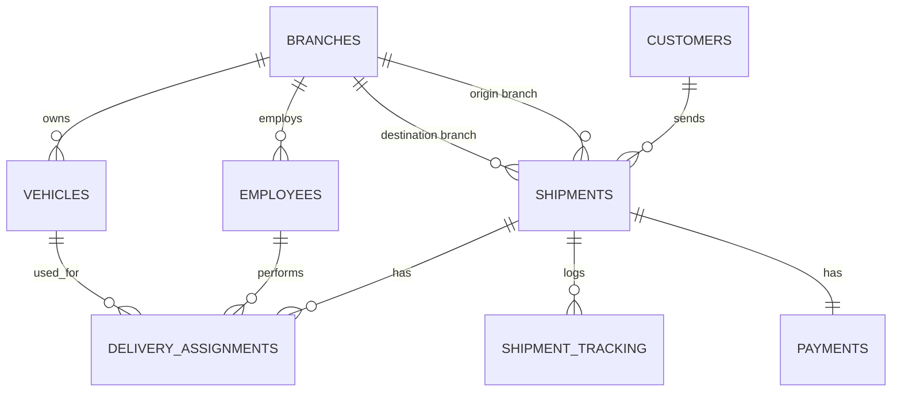

# DBMS-COURIER-MANAGEMENT-DTABASE
# Courier management system — database design

A relational database for a courier company, modelled on how DTDC, Blue Dart
or FedEx actually work: branches book parcels ("shipments"), route them
between cities, and every shipment carries a live status history — the same
data a "track my order" page reads from.

Everything below is implemented in `courier_management_system.sql`
(MySQL / MariaDB 10.2+). It creates the database, loads sample data, and
includes a view, a trigger, and a stored procedure so you can *see* the
design work, not just read it.

## Entity-relationship diagram



(Full attribute list for every table is in the diagram rendered in chat, and
in the `CREATE TABLE` statements themselves.)

## The 8 tables

| Table | What it stores |
|---|---|
| `branches` | Every physical office |
| `customers` | People who book shipments (senders) |
| `employees` | Staff at a branch — managers, delivery agents, clerks, drivers |
| `vehicles` | Delivery vehicles stationed at a branch |
| `shipments` | One row per parcel — the core entity: sender, receiver, route, weight, cost, current status |
| `delivery_assignments` | Which employee + vehicle handled which leg of a shipment (pickup, transfer, final delivery) |
| `shipment_tracking` | The status history of each shipment — one row per tracking event |
| `payments` | One payment record per shipment |

## Design decisions worth knowing for your viva

**Normalization.** Every table is in 3NF: no repeating groups, every
non-key attribute depends on the whole primary key and nothing but the key.
For example, `branch_name` and `city` live only in `branches` — `shipments`
just holds `origin_branch_id` / `destination_branch_id` as foreign keys,
so a branch's details never have to be updated in more than one place.

**Why `shipment_tracking` is a separate table, not a column.** A shipment
has *one* current status but *many* status events over its life (booked →
picked up → in transit → delivered). Cramming that history into a single
column on `shipments` would violate 1NF (a column holding a list of
values); a child table with one row per event is the normalized way to
model a 1-to-many "history" relationship.

**Why `origin_branch_id` and `destination_branch_id` are `ON UPDATE RESTRICT`
instead of `CASCADE`, unlike the other foreign keys.** They're also named
in a `CHECK` constraint (`origin_branch_id <> destination_branch_id`).
MySQL/MariaDB won't let a `CHECK` reference a column that a cascading
update could silently change without re-validating it — a real constraint
interaction that's easy to hit once you start combining `CHECK` with
`FOREIGN KEY`.

**The trigger (`trg_sync_shipment_status`).** Fires after every insert into
`shipment_tracking` and updates the shipment's own `current_status` (and
`delivered_date`, if it just arrived) to match. You only ever write to the
tracking log; the shipment's summary status stays correct automatically —
the same way a real tracking system keeps its "current status" field in
sync with the event log underneath it.

**The stored procedure (`sp_book_shipment`).** Books a shipment end to
end in one call: works out the cost from weight and package type,
generates a tracking number, inserts the shipment, logs its first
tracking event, and opens a pending payment — four inserts collapsed into
one `CALL`.

**The views.** `vw_shipment_details` joins shipment, sender, both branches
and payment status into the single wide row a tracking page would query.
`vw_branch_performance` aggregates revenue and delivery counts per branch
— a manager's dashboard query, pre-written.

## Running it

```
mysql -u root -p < courier_management_system.sql
```

That single command creates the database, all 8 tables, loads ~8 rows of
sample data per table, creates both views, the trigger, and the stored
procedure. Section 6 of the file has 10 ready-to-run demo queries —
uncomment and run them one at a time to see joins, `GROUP BY`/`HAVING`,
the view, the procedure, and the trigger all in action.


